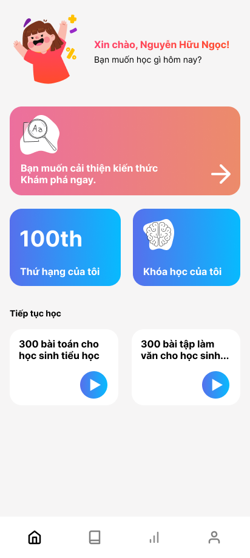
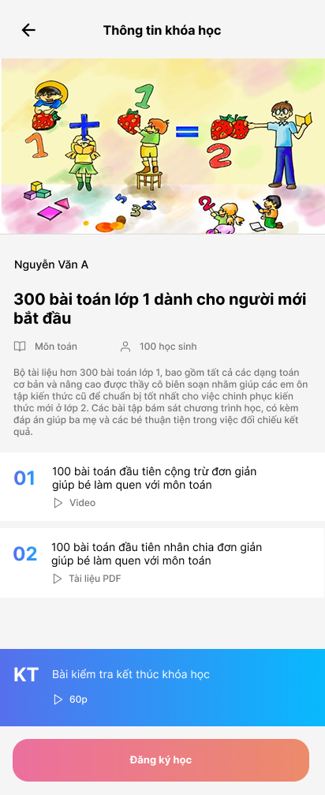
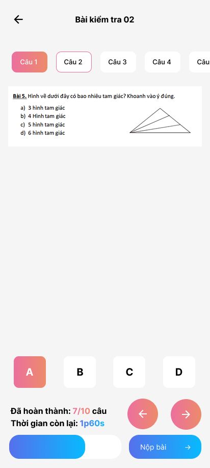

# 123Study! 📚 – E-learning Mobile Application

**123Study!** is a modern e-learning mobile application specifically designed for **primary school students**.  
It helps them learn more effectively through video lessons, PDF materials, and interactive multiple-choice quizzes.  
The app is built using **Flutter** for the frontend and **Dart Frog** for the backend, following **Clean Architecture** principles to ensure scalability and maintainability.

<div style="display: flex; gap: 10px;">
  
  

</div>

---

## 🚀 Features

### 🔐 Email Authentication
- Sign up, login, logout using email
- Backend authentication flow implemented with Dart Frog

### 📘 Course Management (CRUD)
- Create, view, update, and delete courses
- Each course includes title, description, thumbnail, ...

### 📝 Enrollment Management
- Students can register/unregister for courses
- Admin can manage student enrollments

### 🎥 Lesson Content
- Lessons can include:
    - **Video** (embedded or linked)
    - **PDF documents** for reference

### ❓ Multiple-Choice Quizzes
- Interactive quizzes per course
- Tracks correct/incorrect answers with instant feedback

### ❓ Other
- Chat bot using Google Gemini API
- Recover password via email

---

## 🧱 Architecture & Tech Stack

### 📱 Frontend
- **Flutter** (cross-platform)
- **BloC (Cubit)** for state management
- **Clean Architecture** structure

### 🖥️ Backend
- **Dart Frog** (Dart-based lightweight backend framework)
- RESTful API for authentication, courses, lessons, quizzes

---

## 🛠️ Getting Started

1. Flutter version: 
2. Gen image, font:
```dart
dart run build_runner build --delete-conflicting-outputs
```